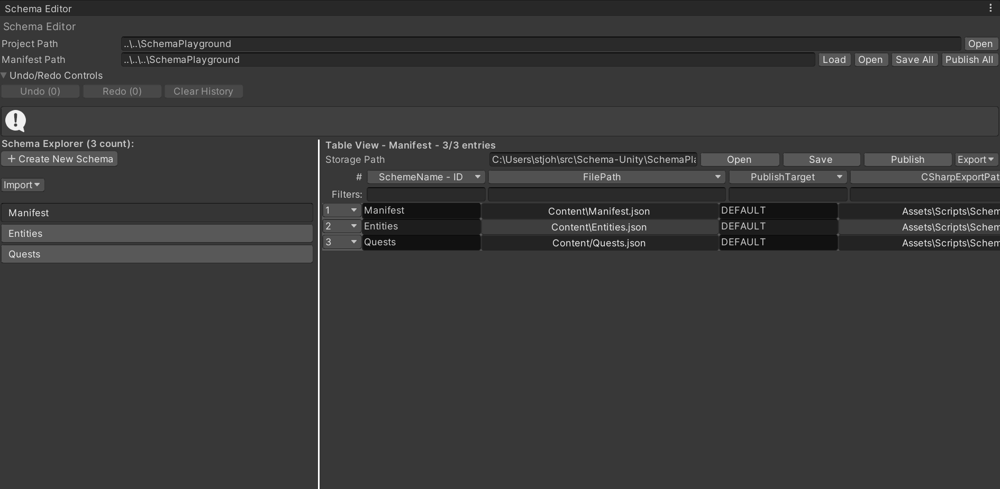
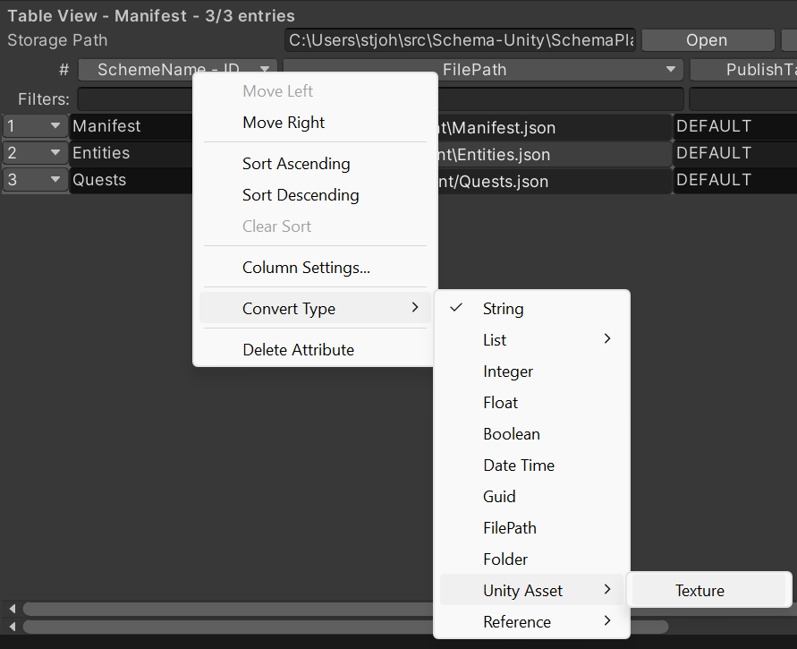
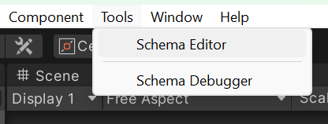

# Schema-Unity


Schema-Unity provides Unity integrations for the Schema content management tool, enabling robust, flexible, and maintainable management of game design data within Unity projects.

### Highlights
- Table editor with fast, virtualized grid and publishing
  
  

- Rich attribute type system with easy type selection
  
  

## Documentation

- **Start here:** [docs/Overview](docs/Overview.md)
- **Quickstart:** [docs/Quickstart](docs/Quickstart.md)
- **Key Concepts:** [docs/KeyConcepts](docs/KeyConcepts.md)
- **Unity Editor Guide:** [docs/EditorGuide](docs/EditorGuide.md)
- **Runtime Integration:** [docs/RuntimeGuide](docs/RuntimeGuide.md)
- **FAQ & Troubleshooting:** [docs/FAQ](docs/FAQ.md)

## Features

- **Schema Core**: C# library for defining, loading, and validating data schemas.
- **Unity Integration**: Custom Unity editor tools for managing schema-based data.
- **Sample Content**: Example JSON and CSV files for rapid prototyping and testing.
- **Extensible**: Easily add new data types, serialization formats, and editor extensions.

## Project Structure

```
Schema-Unity/
  Schema/                  # Core C# library and tests
    Schema.Core/
    Schema.Core.Tests/
  SchemaPlayground/        # Unity project with sample content and editor extensions
    Content/
    Packages/
      com.devzappy.schema.unity/
        Core/
        Editor/
  docs/                    # Guides and reference documentation
```

## Getting Started

See the full [Quickstart](docs/Quickstart.md).

### 1) Quick Start: Integrate into an existing project (Unity Package Manager)

Install via Git URL (no download required):
1. Open your Unity project
2. Open `Window > Package Manager`
3. Click `+` and select `Add package from git URL...`
4. Paste: `https://github.com/zappy-dev/Schema-Unity.git?path=/SchemaPlayground/Packages/com.devzappy.schema.unity#main`
5. After install, open `Tools > Schema Editor`
   
   

Try it quickly (optional):
- Create a simple scheme and entries, then publish and generate C#.
- Initialize at runtime with `Schema.Runtime.SchemaRuntime.Initialize()`.

### 2) Local Setup (clone the repo)

Prerequisites:
- **Unity** (2021.3+ recommended)
- **.NET SDK 8** (for building and testing core libraries)

Steps:
1. Clone:
   ```bash
   git clone https://github.com/zappy-dev/Schema-Unity.git
   cd Schema-Unity
   ```
2. Open `SchemaPlayground/` in Unity
3. Try it now:
   - Load `Assets/Scenes/SampleScene.unity`
   - Open `Tools > Schema Editor` and explore `Manifest`, `Entities`, `Quests`
   - Press Play to see the `Player2DController` sample
4. Build core libraries (optional):
   - Open `Schema/Schema.sln` in Visual Studio or Rider and build
5. Run tests (optional):
   - `dotnet test Schema/Schema.Core.Tests/Schema.Core.Tests.csproj`

Add as local package from disk (optional):
1. `Window > Package Manager`
2. Click `+` > `Add package from disk...`
3. Select `SchemaPlayground/Packages/com.devzappy.schema.unity/package.json`

## Usage

- Use the Unity Editor tools (under `Tools > Schema Editor`) to import, edit, and validate schema-based data.
- Place your JSON/CSV data files in `SchemaPlayground/Content/`.
- Extend or customize schema definitions in `SchemaPlayground/Packages/com.devzappy.schema.unity/Core/Data/`.

## Contributing

Contributions are welcome! See [docs/Contributing](docs/Contributing.md).

## Support

For help, email support@devzappy.com.

## License

This project is licensed under the MIT License. See the [LICENSE](LICENSE) file for details.
